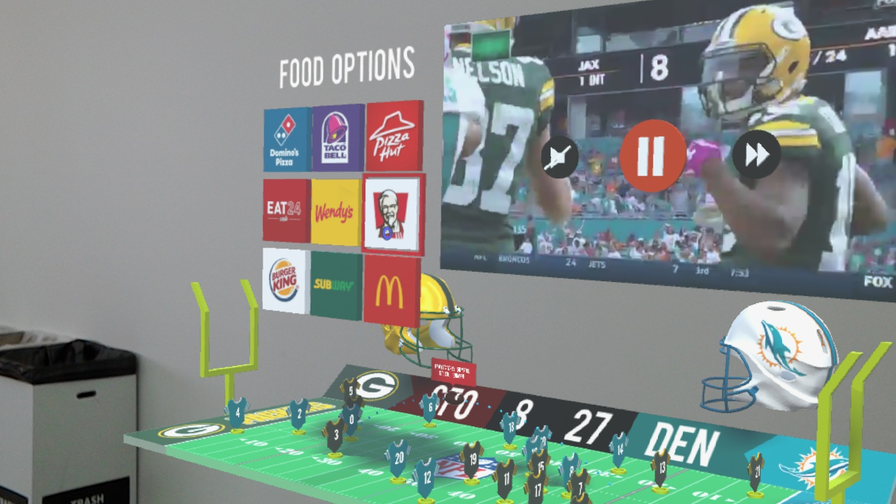
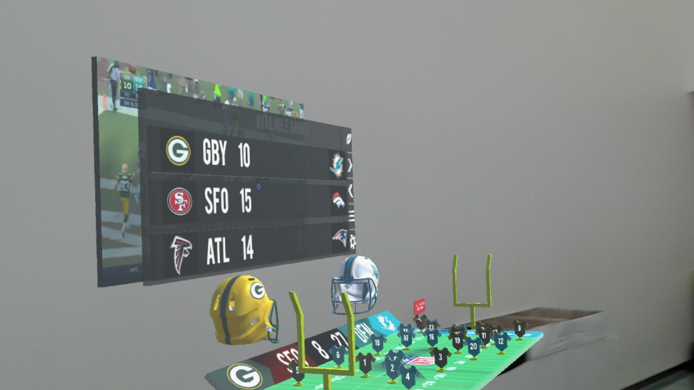
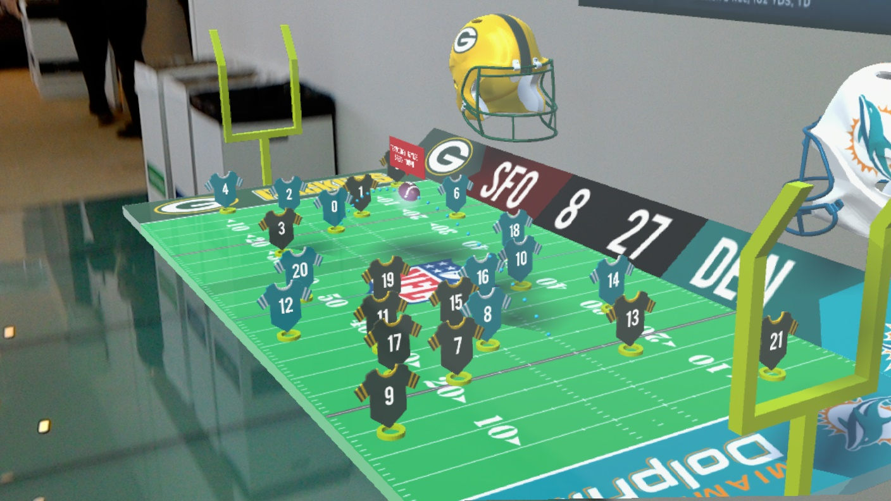
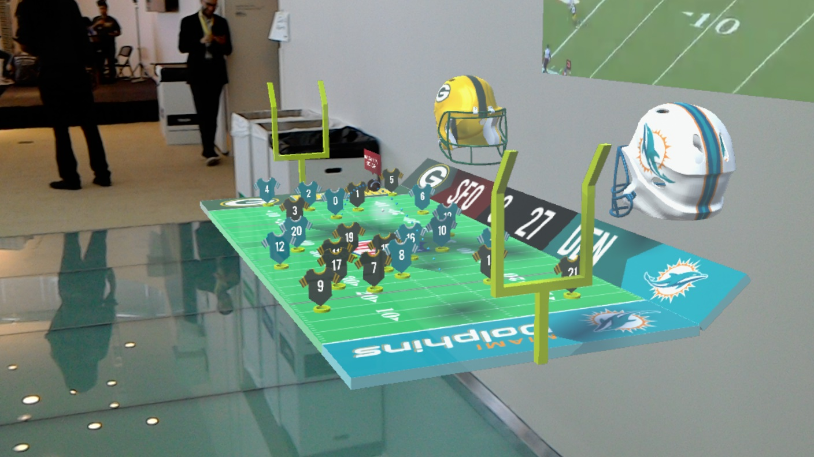
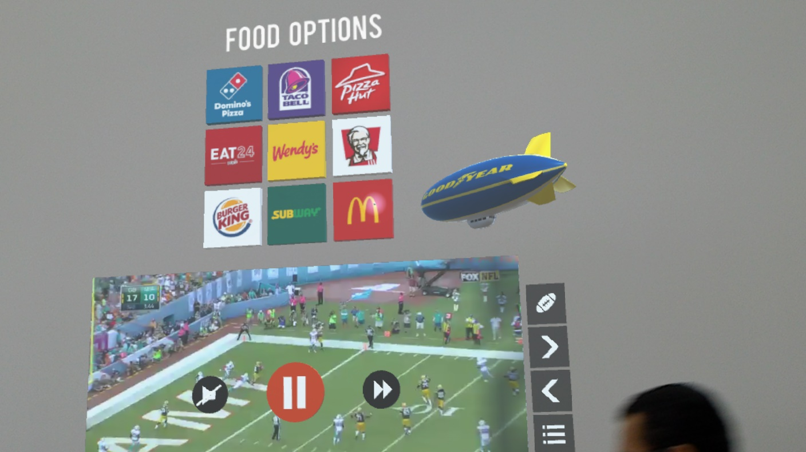
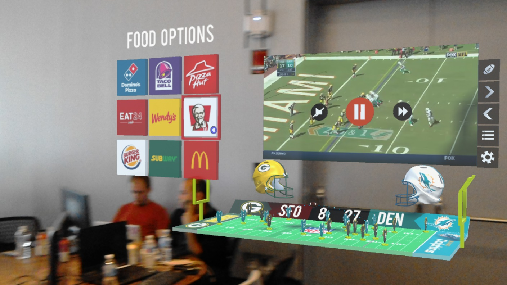

# ARSports
************************************************************************************

## Inspiration

**The fact that the sports-watching experience is still constrained to just watching it on TV**

Imagine if the user can be also made a part of the sport and experience it in a more immersive way, where he is interacting with the game and making decisions on how to view it, get information from it and not just be limited to what the game broadcast offers, but experience beyond that.

ARSports brings the Game to the user as opposed to the user going to the game, and leverage voice-based commands and gestures to interact with the game, order food and more. This application has a potential to apply to any sport with the user being the center of the experience.

This application can be further be enhanced to have a shared viewing experience with other hololens users and can also be supported by VR Devices.

**ARSports is Agumented Reality Experience built with Open Source Applications and Tools.**

## Assets

* Built on Unity 3D - 2017 1.1f1 Personal
* Assets built using Blender 2.78 
* Device support - Micrsoft Hololens

## What it does?

Allows the user to have a more immersive experience when it comes to watching any type of sport.

## How to view the application

Clone the Github source code into local machine.
`git clone https://github.com/Reality-Virtually-Hackathon/The_Dims.git`

Open the source code in Unity 3D and Generate a build for Hololens and deploy the build on the device.

## Screenshots

